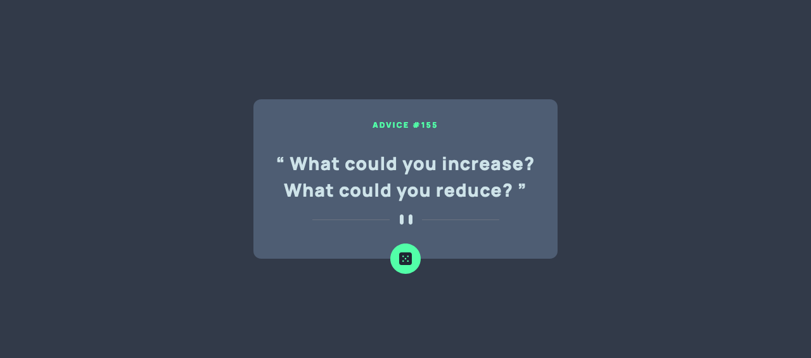
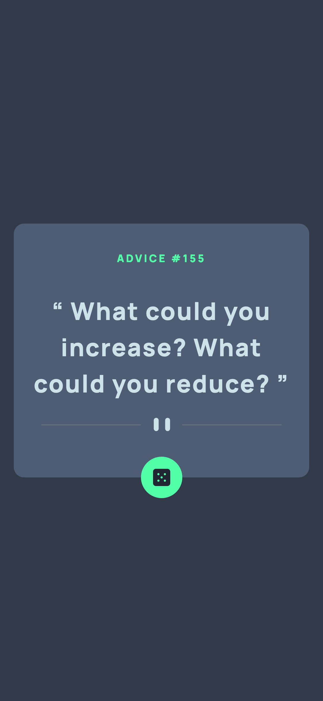

# Frontend Mentor - Advice generator app solution

This is a solution to the [Advice generator app challenge on Frontend Mentor](https://www.frontendmentor.io/challenges/advice-generator-app-QdUG-13db). Frontend Mentor challenges help you improve your coding skills by building realistic projects.

## Table of contents

- [Overview](#overview)
  - [The challenge](#the-challenge)
  - [Screenshot](#screenshot)
  - [Links](#links)
- [My process](#my-process)
  - [Built with](#built-with)
- [Author](#author)

## Overview

### The challenge

Users should be able to:

-

### Screenshot

### Links

- Solution URL: [github repo](https://github.com/Nabster2010/Frontend-Mentor---Advice-generator-app)
- Live Site URL: [live site]()

## My process

### Built with

- Semantic HTML5 markup
- tailwindcss
- Mobile-first workflow
- [Next.js](https://nextjs.org/) - React framework

## Author

- Frontend Mentor - [@Nabster2010](https://www.frontendmentor.io/profile/Nabster2010)
- Twitter - [@yMahmoudElGarhey](https://www.twitter.com/MahmoudElGarhey)
